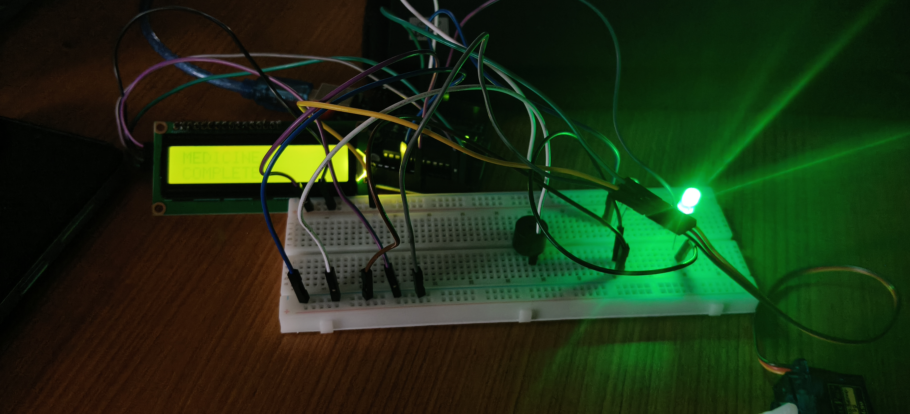

# _Smart_Medicine_Box

## Description

The Smart Medicine Box is an automated system that reminds users to take their medicines at the correct time. It uses an RTC module to track time, a buzzer and LCD to provide reminders, and a servo motor to open the required medicine compartment. An ESP8266 Wi-Fi module is used to send notifications to a mobile device.

## Required Components

- Arduino Uno
- ESP8266 Wi-Fi Module
- RTC DS3231
- 16×2 LCD Display
- SG90 Servo Motor
- Buzzer
- Push Button
- Medicine Box
- Breadboard
- Jumper Wires
- Resistors
- 5V Power Supply

## Project Setup

The Arduino Uno acts as the main controller. The RTC DS3231 provides accurate time information. The LCD displays the current time and medicine reminder. When the preset medicine time is reached, the buzzer gives an alert and the servo motor opens the required medicine compartment.

The ESP8266 provides Wi-Fi connectivity and sends a notification to the user's mobile device.

### Project Setup Image

## Procedure

1. Connect the RTC DS3231 module to the Arduino Uno.
2. Connect the 16×2 LCD display.
3. Connect the buzzer and push button.
4. Connect the SG90 servo motor to the medicine compartment.
5. Connect the ESP8266 Wi-Fi module.
6. Set the required medicine time in the program.
7. Upload the program to the Arduino.
8. Power the complete circuit.
9. At the preset time, the buzzer gives an alert.
10. The LCD displays the medicine reminder.
11. The servo motor opens the required medicine compartment.
12. The ESP8266 sends a notification to the mobile device.

## Functions

### RTC DS3231

Provides accurate date and time.

### Arduino Uno

Controls the complete system.

### LCD Display

Displays the current time and medicine reminders.

### Buzzer

Provides an audio alert at the scheduled time.

### Servo Motor

Opens the selected medicine compartment.

### ESP8266

Provides Wi-Fi connectivity and sends notifications.

### Push Button

Allows the user to confirm the medicine reminder.

## Expected Output

The Smart Medicine Box reminds the user at the scheduled medicine time, provides an audio and visual alert, opens the required medicine compartment automatically, and sends a notification to the mobile device through Wi-Fi.

## Future Improvements

- Mobile application integration
- Medicine quantity monitoring
- Multiple medicine schedules
- Missed-dose notification
- Cloud-based medicine history
